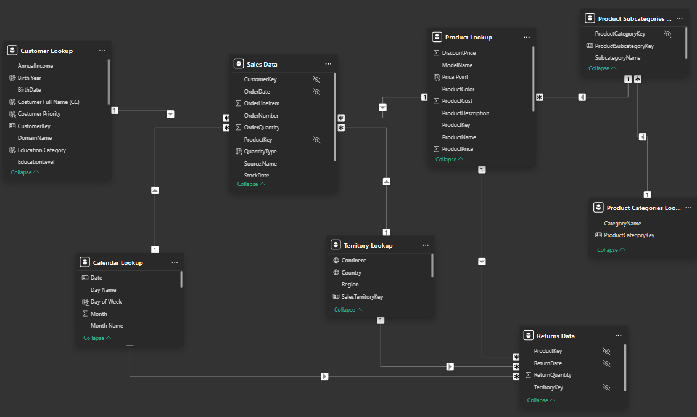
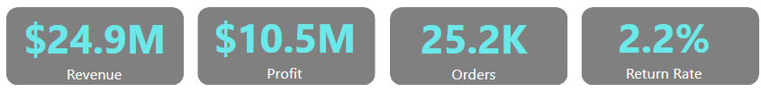
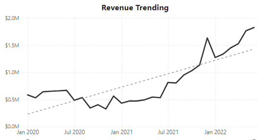
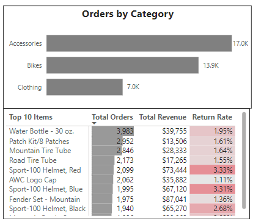
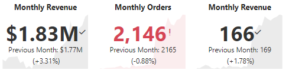

<!DOCTYPE html>
<body>
# Power_BI_project
This project uses a dataset from an outdoor sports company AdventureWorks and explores several business metrics and tracks the companies performance using prodect level as well as regional and client based data.

Below is the data model consisting of two main data tables and several lookup tables

The main source of the data used for this analysis are transactions split between two tables, returns and sales. The lookup tables offer filtering contexts for region, time, customers, and products allowing for a comprehensive analysis of sales and returns from multiple business angles and varying levels of granularity.

## executive summary
Year to date revenue from beginning of operations in Jan, 2020 to (blank) is $24.9 million and Year to date profit is $10.5 million. Trailing 12 month revenue for this quater was %15.5 million, more than 50% percent of total revenue to date, showing considerable growth within the past 12 months.

</body>

