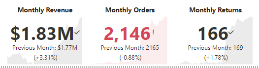
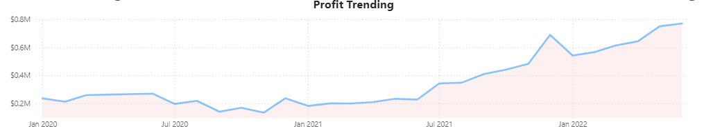
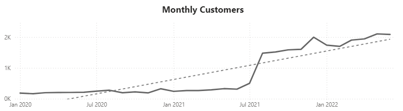
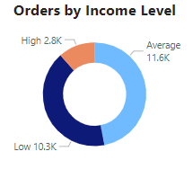
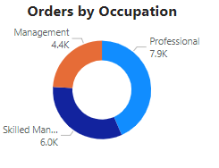

<!DOCTYPE html>
<body>
  
# Power_BI_project
---
This project uses a dataset from an outdoor sports bike company AdventureWorks and explores several business metrics and tracks the companies performance using prodect level as well as regional and client based data.

Below is the data model consisting of two main data tables and several lookup tables

The main source of the data used for this analysis are transactions split between two tables, returns and sales. The lookup tables offer filtering contexts for region, time, customers, and products allowing for a comprehensive analysis of sales and returns from multiple business angles and varying levels of granularity.

## Executive Summary
---
Year to date revenue from beginning of operations in Jan, 2020 to (blank) is $24.9 million and Year to date profit is $10.5 million. Trailing 12 month revenue for this quater was $15.5 million, more than 50% percent of total revenue to date, showing considerable growth within the past 12 months.

The bike accessories product category comprised 45% of orders, indicating that customers prefer us for our many bike customization options and repairs.
The clothing product category made up a significantly smallar proportion of orders at 18.5%. This data combined with helmets having a return rate of over 3%, which was 33% higher than the average return rate for all items indicates that the clothing product category is an area that needs attention.
Despite this, monthly returns are down from previous month. Monthly revenue is higher while orders are lower due to more high ticket items being sold than the previous month.
Most of our recent revenue growth is due to the addition of our clothing and accesory product lines.
To maintain goals of 10% growth per month, additional product line expansion and marketing to higher end customers in order to sell higher ticket items are suggested to meet company goals.

## International growth

Total orders to date in Europe and the U.K combined represent 7,380 while total orders in Australia reached 6,060. The U.S. totaled 8,700 orders and Canada reached 3,024 orders. While the U.S. is are largest market we have gained a significant footprint overseas to the point that establishing warehouses in those region may offset shipping and logistics costs while building better customer relations.

## Product Level Analysis and Profit

Our goal of 10% growth per month fell short last month in revenue, profit and total orders. This months metric, shown in the middle of each gauge, and the 10% growth target, marked with a bar on the gauge, shows that each metric fell just short in each category by 10%, implying no growth from the previous month.

Growth has accelarated for the past 12 months; however, our clothing and accesory product lines came into full production 12 months ago and to achieve the same level of growth, additional product expansion or marketing strategies will need to be employed to meet our goals.

## Client Level Analysis

Our monthly customers saw a marked increase of 515% just after the start of our accesory and clothing product lines from an average of 330 monthly to 1700 monthly customers. This is evidence of the success of recent product expansions and we suggest additional market research to uncover if any unmet demand can be met.

The majority of our customer base is

</body>

